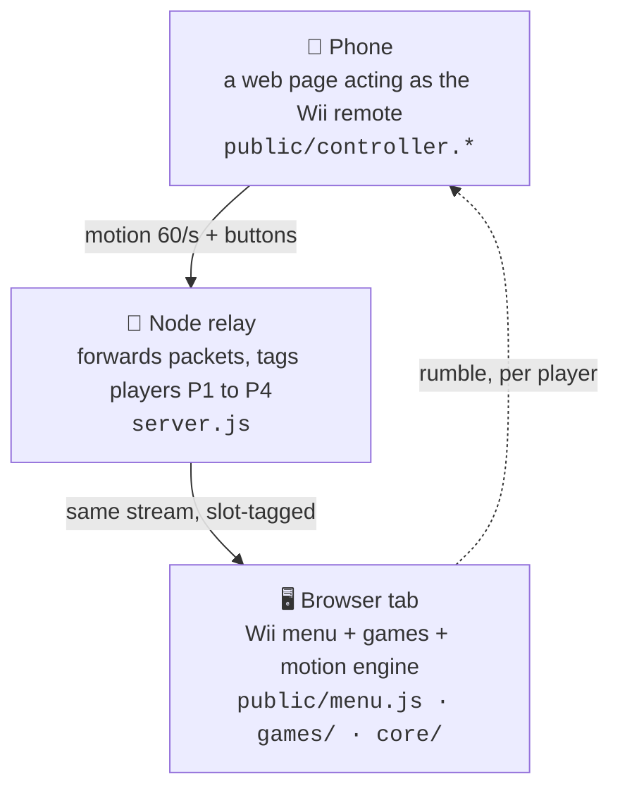

# 🕹 OpenWii

Play the Wii with your phone.

A browser tab on your computer shows a Wii menu. Scan the QR code on screen and
your phone becomes the remote: swing it and a hand cursor sweeps across the
screen. Point at a channel, press A, and you're slicing fruit. No app, no
console, no extra hardware. Up to **four phones** can join the same screen.

<!-- demo video: drag openwii_demo.mp4 into this line on github.com and it embeds -->

> [!TIP]
> Drop this repo into Claude Code or any AI coding agent and ask it questions:
> how the pointer learns your grip, or how a folder becomes a channel. It's a
> small codebase and it explains itself well.

## Run it

```bash
npm install
npm start
```

1. On macOS the server auto-opens Chrome at **https://localhost:8443/** in a
   dedicated profile. Elsewhere, open that URL yourself (`NO_OPEN=1` skips the
   auto-open).
2. Scan the QR code with your phone on the same Wi-Fi and accept the
   certificate warning once.
3. Tap **Enable motion sensors** and swing. There is no calibration step: the
   pointer learns your phone's gyroscope conventions from the first second of
   motion, whatever way you hold it.

On the remote: **A** is the action button, **B** or **⌂** goes back to the
menu, **− / +** adjusts pointer speed, **1** re-centres the cursor. The mouse
drives the cursor whenever no phone is connected, so every game stays playable
on its own (`HTTP=1 npm start` for a quick mouse-only server).

> [!WARNING]
> **HTTPS is not optional, and it's the #1 thing that breaks.** Browsers gate
> motion sensors behind a secure context, and Chrome enforces it *silently*:
> listeners attach, no error is thrown, and events never fire. That's why
> `npm start` serves HTTPS with a self-signed certificate. If the cursor won't
> move, check the phone is on the `https://` address before anything else.

## How it works



The interesting part is `core/pointer.js`. A real Wii needs an IR sensor bar to
know where the remote points; OpenWii replaces it with pure software. The
engine learns each phone's gyro axis conventions from its own data at runtime
(they genuinely differ between devices), heals drift back toward the true pose
between swings, and dead-reckons the cursor slightly ahead of the packet
stream so it never feels laggy.

## The games

| | | |
| --- | --- | --- |
| 🍉 **Fruit Ninja** | Swing the phone like a sword. Slice fruit, dodge bombs. Up to 4 blades on one board. | [`games/fruit-ninja`](games/fruit-ninja) |
| ⚔️ **Swordplay** | Duel a fencer: swing to strike, hold your blade to block. | [`games/swordplay`](games/swordplay) |
| 🏓 **Table Tennis** | Track the ball, swing at contact for pace. First to 11. | [`games/table-tennis`](games/table-tennis) |
| ⛳ **Golf** | Drive, approach, putt. Swing hard off the tee, soft on the green. | [`games/golf`](games/golf) |
| 🛩 **Island Flyover** | Hold the phone flat like a paper plane and thread the rings. | [`games/island-flyover`](games/island-flyover) |
| 🏎 **Kart Time Trial** | Tilt to steer. Three laps, one clock, and your own ghost. | [`games/kart`](games/kart) |

Fruit Ninja is the most developed of the six, with multiplayer, criticals,
and combos.

## Adding a game

Drop a folder into `games/` with an `index.html`. The server discovers it on
boot and the menu grows a channel; there is no registry to edit.

```
games/your-game/
  index.html     loads socket.io + your game.js
  game.json      { title, tagline, emoji }   ← optional, for the channel card
  logic.js       your rules, kept free of rendering so they test headlessly
  game.js        your renderer
```

`core/channel.js` gives you a calibrated pointer, the player link, and the home
button in a few lines; see any of the six games for the pattern.

## Name

Not affiliated with, endorsed by, or connected to Nintendo. "Wii" is Nintendo's
trademark; this project is an independent, open-source take on playing
motion-controlled games in a browser.

## License

[MIT](LICENSE)
